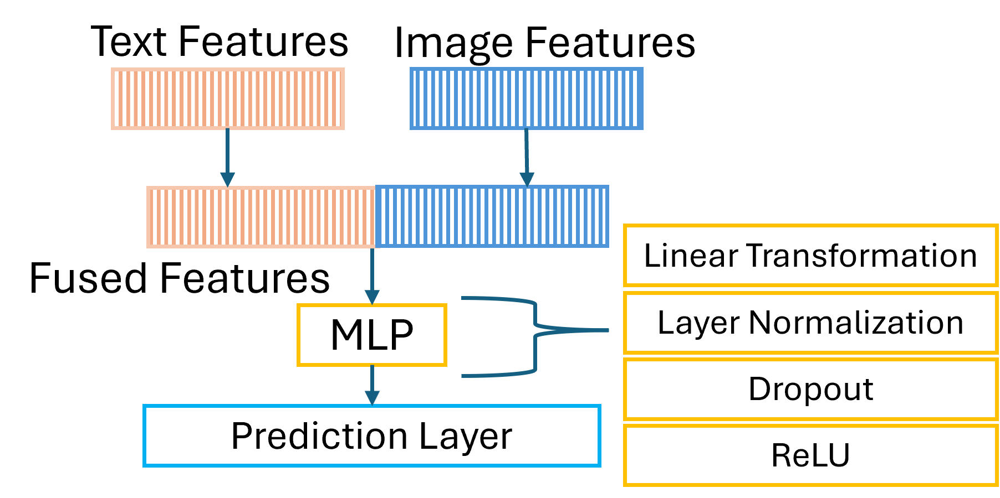
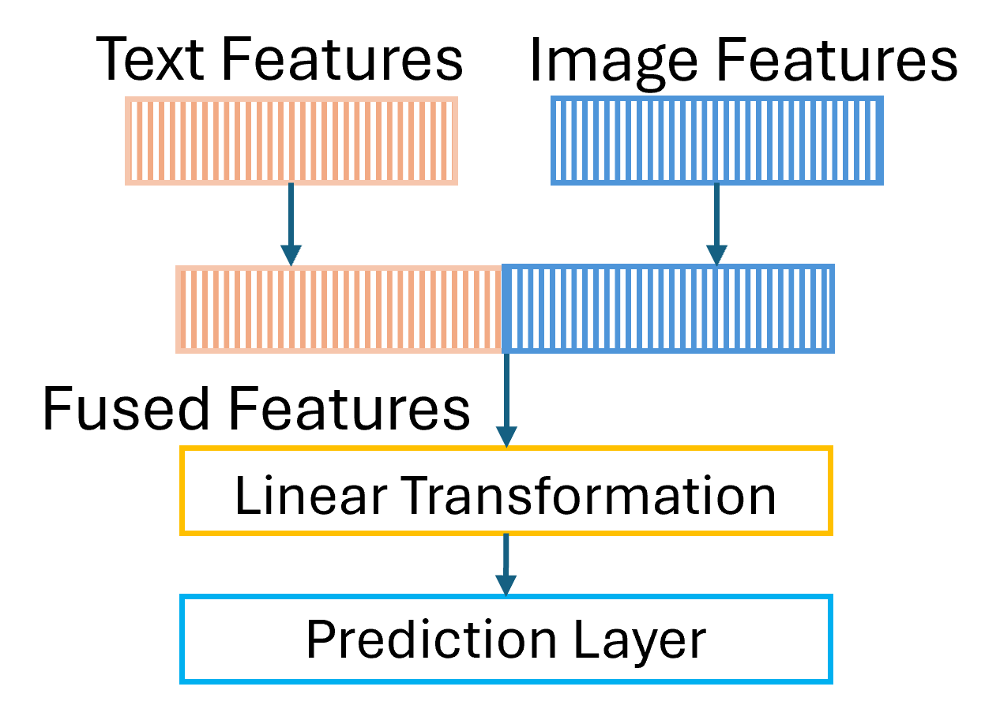

# Multi-modal-MAML-Revisiting-Features-Fusion-for-Generalization-and-Class-Distribution
This is the code of Paper Title: Multi-modal MAML: Revisiting Features Fusion for Discriminative Generalization and Class Distribution

Abstract:
Class distribution methods determine how classes are allocated across meta-train, meta-val, and meta-test sets, impacting meta-learning algorithms such as Prototypical Networks and MAML when trained from scratch on small datasets. We hypothesize that learning more class-discriminative features can mitigate the effect of class distribution. To address this, we propose Multi-modal MAML, which integrates visual and textual modalities via linear and attention-based fusion to produce more discriminative features. While prior work highlights challenges in training MAML with multimodal data, we systematically investigate factors affecting performance on small datasets—SLAKE, CUB, and Flower—including tensor size, textual feature extraction, and fusion techniques. Our linear fusion experiments achieve super-convergence, and we explore inner and outer learning rates, step size, and weight decay to optimize attention-based experiments. Our model achieves superior or comparable performance to nine baselines, with three key findings: (1) MAML’s computational cost does not hinder learning discriminative features; (2) multimodality does not mitigate class distribution effects; and (3) multimodality does not always improve performance across class distribution methods.

################ acknowledgment #############################

The Main code is based on the implementation taken from [How to Train Your MAML to Excel in Few-Shot Classification](https://arxiv.org/abs/2106.16245)" (Accepted by ICLR 2022) in PyTorch. 

If you use any content of this repo for your work, please cite the following bib entry:

    @inproceedings{ye2021UNICORN,
      author    = {Han-Jia Ye and
                   Wei-Lun Chao},
	  title     = {How to Train Your {MAML} to Excel in Few-Shot Classification},
	  booktitle = {10th International Conference on Learning Representations ({ICLR})},
	  year      = {2021}
	}

In the models folder, the implementation of all the attention based classes, namely attention, SelfAttentionForTwoTexts, sentence_transformer_attention are generated using the AI assistant claude.ai

################################ Datasets ##################################
You can find the data splits on the datasplits folder.
if you would like to obtain our results use the splits folder (with 350 data samples ). the full_split folder includes larger data samples. The datasets can be downloaded from the followings:
SLAKE: SLAKE DATASET folder contains our few-shot image classification modified version taken originally from https://www.med-vqa.com/slake/
FLOWER: https://www.robots.ox.ac.uk/~vgg/data/flowers/102/
CUB: http://www.vision.caltech.edu/visipedia

Please fix the data paths on the .py files included in the dataloader folder. 

################################ Requirements ##################################
3- requirements.yml includes the requirements/dependencies to run the code.

################################ Arguments ##################################

We have 9 Experiements, see 

You can run by changing the configuration setting in Utils.py file.
--exp_name determines the experiment [check the paper for more details]
--text_encoder detemines textual feature extraction techniques
--voc_size if you run Exp1, choose 200 else 350
--lr is meta-update/outer learning rate
--gd_lr specific task/inner learning rate

The values the give the highest accuracy with the three datasets are with the following arguemnts:

|exp_name | dataset |  text_encoder | voc_size | lr | gd_lr | step_size | mom | weight_decay|
|---------|:-------:|:-------:|:-------:|:-------:|:-------:|:-------:|:-------:|-------:|
|Exp1 | SLAKE | Transformer | 200 | 1e-3 | 0.004532305926969549 | 100 | 0.9 | 1e-3|
|Exp1 | CUB/FLOWER | FastText | 200 | 1e-3 | 0.004532305926969549 | 100 | 0.9 | 1e-3|
|Exp7 | SLAKE  | Transformer | 350 |  0.001 | 0.004532305926969549 | 80 | 0.9 | 0.001|
|Exp7 | CUB  | FastText | 350 |  0.001 | 0.004532305926969549 | 80 | 0.9 | 0.001|
|Exp7 | FLOWER  | Transformer | 350 |  0.001 | 0.004532305926969549 | 80 | 0.9 | 0.001|

Exp2, 3, 4, 5 have same Exp 1 settings except voc_size is set to 350.

Exp6, 8, 9 have the same text_encoder (Transformer), voc_size (350), step_size (100), mom (0.9) weight_decay (0.005).

|exp_name | dataset  | lr | gd_lr|
|---------|:-------:|:-------:|-------:|
|Exp 6 | SLAKE | 1e-06 | 0.005 |
|Exp 6 | CUB | 1e-05 | 0.003|
|Exp 6 | FLOWER | 1e-06 | 0.004532305926969549|
|Exp 8 | SLAKE | 1e-06 | 0.01| 
|Exp 8 | CUB | 1e-06 | 0.01|
|Exp 8 | FLOWER | 1e-06 | 0.01|  
|Exp 9 | SLAKE | 1e-06 | 0.001 |
|Exp 9 | CUB | 1e-05 | 0.003|
|Exp 9 | FLOWER | 1e-05 | 0.003| 

################################ Running the code ##################################

You can modify main.job to run the code or type python train_fsl.py
